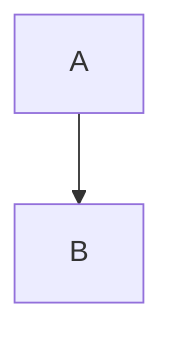

## 🙂 说在前面

这篇文章的第一读者是我自己，为了减少冗余内容，默认看到的老铁们已经有了 `nuxt` 的知识储备，以下仅贴出`Mermaid`的文档链接,方便查阅~

### Mermaid
::link-card
---
icon: https://avatars.githubusercontent.com/u/57169982
title: Mermaid
description: JavaScript based diagramming and charting tool
link: "https://mermaid.js.org"
---
::

## ✨ 目标

在 `.md` 文件里用mermaid语法来绘制流程图,例如：

````md

````

会渲染成这样的图表：


🤔 理想情况下实现这样的效果，应该需要封装这么一个组件：接收 markdown 中代码块的文本内容，识别出 mermaid 语法并通过 mermaid.js 渲染出来。it's time to try~

---

## 🧱 插件初始化 Mermaid

先实现 Nuxt 插件 `mermaid.client.ts`，让 Mermaid 初始化一次：

```ts [mermaid.client.ts]
import mermaid from 'mermaid'

export default defineNuxtPlugin(() => {
    mermaid.initialize({
        startOnLoad: false,
    })

    return {
        provide: {
            mermaid
        }
    }
})
```

## 💯 实现 `Mermaid.vue`

接收 Markdown中的 mermaid code，通过 mermaid.js 渲染出来。大概逻辑：

1. 拿到插槽内容
2. 用 `$mermaid.render()` 渲染出 SVG
3. 把 SVG 插进页面里

```vue [Mermaid.vue]
<script setup>
import { nodeTextContent } from '@nuxtjs/mdc/runtime/utils/node'

const el = ref(null)
const rendered = ref(false)
const rerenderCounter = ref(1)
const slots = useSlots()
const { $mermaid } = useNuxtApp()

const mermaidSyntax = computed(() => {
    rerenderCounter.value // 手动依赖，触发更新

    const defaultSlot = slots.default?.()[0]
    if (!defaultSlot)
        return ''

    // 兼容不同 Markdown 解析形式
    if (typeof defaultSlot.children === 'string')
        return defaultSlot.children

    const codeChild = defaultSlot.children?.default?.()?.[0]
    if (!codeChild || codeChild.type !== 'code')
        return ''
    return typeof codeChild.children === 'string'
        ? codeChild.children
        : nodeTextContent(codeChild.children)
})

async function render() {
    if (!el.value || !mermaidSyntax.value)
        return
    if (el.value.querySelector('svg'))
        return

    rendered.value = true
    await $mermaid.run({ nodes: [el.value] })
}

onBeforeUpdate(() => {
    rerenderCounter.value++
})

onMounted(() => {
    render()
})
</script>

<template>
    <pre ref="el" :style="{ display: rendered ? 'block' : 'none' }" class="not-prose">
    {{ mermaidSyntax }}
  </pre>
</template>
```

## 🧩 修改`ProsePre`

修改 `ProsePre.vue`, 如果识别到 `language` 为 `mermaid`, 则将内容传递给`Mermaid.vue`

```vue [ProsePre.vue]
// 当 language 为 mermaid 时,隐藏codeblock, 将内容传递给 Mermaid 组件
<script setup>
...
const isMermaid = ref<boolean>(props.language === 'mermaid')
</script>

<template>
    <figure class="z-codeblock">
        <figcaption>
            <span v-if="filename" class="filename">
                <ClientOnly>
                    <Icon :class="{ 'icon-revert': !meta.icon && $colorMode.value === 'light' }" :name="icon" />
                </ClientOnly>
                {{ filename }}
            </span>
            <span v-else />
            <span v-if="language" class="language">{{ language }}</span>
            <div class="operations">
                <button v-if="!isMermaid" @click="isWrap = !isWrap">
                    {{ isWrap ? '横向滚动' : '自动换行' }}
                </button>
                <button ref="copy-btn">
                    复制
                </button>
            </div>
        </figcaption>

        <pre v-if="!isMermaid" ref="codeblock" class="scrollcheck-x"
        :class="[props.class, { wrap: isWrap }]">
            <slot />
        </pre>
        <Mermaid v-else>
            {{ code }}
        </Mermaid>
    </figure>
</template>
```

到这里基本上可以实现：根据输入mermaid内容，渲染出图表的效果了，但是使用过程中发现一个问题：多图渲染偶尔会出现图片重叠的情况。

---

## 🧨 渲染多图时 ID 冲突，图表出现重叠/错乱

使用过程中发现：如果有多张 Mermaid 图需要同时渲染，会偶发出现 ID 相同的情况（Mermaid默认通过时间戳作为id），**ChatGPT** 给的回答是：当 ID 相同时，mermaid 会复用之前的 SVG 里的 `<defs>`、样式等，导致图表渲染错乱。

### ✅ 解决方案：每个图用唯一的 ID Seed

修改插件内容, 设置自定义ID

```ts [mermaid.client.ts]
import mermaid from 'mermaid'

export default defineNuxtPlugin(() => {
    mermaid.initialize({
        startOnLoad: false,
        deterministicIds: true, // 设置为 true, Mermaid.vue 中必须通过 render() 方法来渲染图表, 传入ID
    })

    return {
        provide: {
            mermaid
        }
    }
})
```

添加工具函数来稳定地生成 ID，内容不一样就不会冲突：

```ts
export function useStableMermaidId(code: string, prefix = 'mermaid') {
    let hash = 0
    for (let i = 0; i < code.length; i++) {
        hash = ((hash << 5) - hash) + code.charCodeAt(i)
        hash |= 0
    }
    return `${prefix}-${Math.abs(hash)}`
}
```

把原来的`run()` =>  `render()` , 这样用：

```vue [Mermaid.vue]
<script setup>
...
const id = useStableMermaidId(mermaidSyntax.value)
const { svg, bindFunctions } = await $mermaid.render(
  id,
  mermaidSyntax.value,
  el.value
)
el.value.innerHTML = svg
</script>
```

✅ 这样就能确保每个图在内容不一样时都是独立渲染的。

---

## ✅ 总结

这次通过封装插件的方式，将mermaid集成到了我的博客里，未来会考虑把`markmap`也封装进来，这样后续绘制流程图和思维导图时，不需要额外存储图片，而且维护改动也变得很简单~
