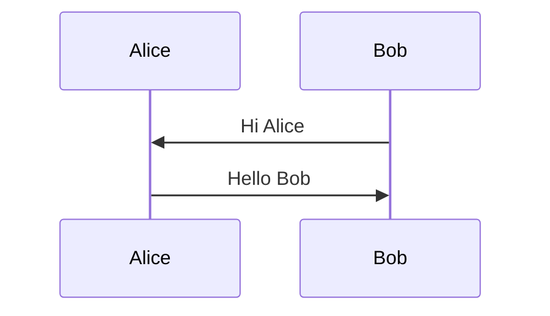

## Markdown 内容组件

Nuxt Content 使用 Markdown 语法和约定来提供丰富的文本编辑体验。它使用自定的 MDC 语法（[文档](https://content.nuxt.com/usage/markdown)），可以让你在 Markdown 中使用 Vue 组件，并支持多种 remark 扩展。

也许要看到[本页源码](https://github.com/L33Z22L11/blog-v3/blob/main/content/previews/example.md)才能领会到这种语法的特性，[就像**这样**——]{.example-info #just-like-this style="color: #00bb66"}，或是主题介绍页面的组件入口卡片那样。

## 内容组件样式示例

我编写了一些可以在 Markdown 文件中调用的组件，以下是一些示例。

### 通过 CSS 类名控制的样式

- 各级标题
  - 在 Front matter 中设置 `type: story` 可以换用不同样式。
  - 跟随 URL Hash（网址锚点）的高亮。
- > 引用。
- 无序和有序列表。
- **粗体**、~~删除线~~。
- 分割线。
---
- 带有 `icon` 类名的图片，如 {.icon}。
- [只在 `type: story` 时🀄]{.title-like}
- [故事感。]{.text-story}
- [阴 影 回 声]{.text-repeat}
- 滚动，然后悄悄[变大变高]{.text-zoom}，惊艳所有人。

### Markdown 原生组件

可以通过 Mardown 原生语法、HTML 语法和 MDC 语法使用的组件。

#### 链接 `ProseA`

[这是内部链接](#链接-prosea)。[站外链接](https://www.baidu.com) 默认在新标签页打开，并在鼠标悬浮时展示域名。

还会根据域名展示图标，例如 [微软文档](https://learn.microsoft.com/zh-cn/)、[GitHub](https://github.com/)、[Bilibili](https://www.bilibili.com/)、[QQ 官网](https://im.qq.com/)、[微信公众号](https://mp.weixin.qq.com/) 等。

::alert{title="自定义图标"}
你可以将 `icon` 属性指定为 Iconify 图标名，例如 :a[a]{href="#链接-prosea" icon="ph:swatches-duotone"}。
::

##### 为更多站点匹配图标

你可以在 `app/utils/icon.ts` 分别为主域名或专门域名（优先级高）添加匹配规则来为更多站点匹配图标。

#### 代码 `ProseInlineCode`

`行内代码` 和 [在超链接中的 `行内代码`](#代码-proseinlinecode)。

#### 代码块 `ProsePre`

```
only text
```

``` [filename]
without language
```

```yaml
language: yaml # without filename
```

```yaml [code block with a loooooooooooooooooooooooooooooooooooooooooooooooooooooooooooooog filename]
feature: |
  如果一行过于loooooooooooooooooooooooooooooooooooooooooooooooooooooooooooooog，溢出滚动时有羽化边缘。
```

```md [CHANGELOG.md]
# 更新日志
- 为特殊文件名指定图标
```

```md [更多功能] icon=ph:files-duotone wrap
- 在 Markdown 文件中，可以通过代码块语法的 meta 标记
  - 直接启用自动换行功能，以展示 loooooooooooooooooooooooooooooooooooooooooooooooooooooooooooooog 文本
  - 自定义代码块图标
```

##### 高亮

代码块通过 Shiki 进行高亮，可在 `blog.config.ts` 中配置语言（Markdown 中出现的所有语言）和代码高亮主题。

##### 为更多语言匹配图标

你可以根据 `app/utils/icon.ts` 语言图标匹配流程为文件后缀、语言简写或别名添加匹配规则来为更多语言匹配图标：

1. 查找 `file2icon` 映射表，将文件名后缀替换为图标名。
2. 若无匹配，查找 `ext2lang` 映射表，将语言简写或别名转换为 Catppuccin 图标库中的语言名。
3. 将 Catppuccin 图标库中的语言名转换为 Iconify 图标名。

#### 表格 `ProseTable`

> 打算做表头滚动吸附，但还未实现。目前支持表格横向滚动或自动换行的切换。

| 表头滚动吸附 | 滚动时边缘羽化 | 如果标题或内容很 loooooooooooooooooooooooooooooooooooooooooooooooooooooooooooooog | 这里还有一列，但是是空内容 |
| :----------- | :------------- | :-------------------------------------------------------------------------------- | :------------------------- |
| 未实现       | 已实现         | 可以切换滚动方式                                                                  |

### 自定义组件

可以通过 Vue 模板语法、MDC 语法使用的组件。

#### Alert

::alert{type="question"}
#title
标题插槽的 [超链接](#alert) **粗体** `Inline code`
#default
默认插槽的 [超链接](#alert) **粗体** `Inline code`
::

::alert{type="info"}
#title
标题插槽的 [超链接](#alert) **粗体** `Inline code`
#default
默认插槽的 [超链接](#alert) **粗体** `Inline code`
::

::alert{type="warning"}
#title
标题插槽的 [超链接](#alert) **粗体** `Inline code`
#default
默认插槽的 [超链接](#alert) **粗体** `Inline code`
::

::alert{type="error"}
#title
标题插槽的 [超链接](#alert) **粗体** `Inline code`
#default
默认插槽的 [超链接](#alert) **粗体** `Inline code`
::

:alert{icon="ph:files-duotone" color="var(--c-accent)" title="仅标题，并且自定义图标和颜色"}

#### Badge

:badge[普通带链接]{link="#badge"} :badge[纯文本指定圆形]{round} :badge[纯文本指定方形]{square}

可以 :badge[带个图]{img="https://picsum.photos/100/100"} 也可以只有图 :badge{img="https://picsum.photos/100/100" round}，也能指定方形 :badge{img="https://picsum.photos/100/100" square}

外部域名自动获取站点图标 :badge[百度]{link="https://www.baidu.com"}，
GitHub链接能自动识别头像 :badge[Hiwayo]{link="https://github.com/hway-git"}，

::alert
#title
在其他组件中使用 :badge{img="https://picsum.photos/100/100" text="带链接" link="#badge"}
#default
:badge{img="https://picsum.photos/100/100" text="指定圆形" round} 背景色 [可以 :badge{img="https://picsum.photos/100/100" text="动态变化" square} 使用](#badge)
::

#### :blur[Blur]

:blur[你知道得太多了。]

#### CardList

> 给列表刷上了自定义样式，待完善。

::card-list
- 无序列表项1
- 无序列表项2
  - 无序列表项2-1
  - 无序列表项2-2
::

#### Chat

::chat

{:2024-11-09 23:39:30}

{.}

也许

{.}

我们可以聊聊天

{.我}

我还可以有名字

{:我撤回了一条消息}

{用户1}

有趣\
我学到了。

::

#### Copy

:copy{command="rm -rf # 修改命令后再复制，也可撤销修改"}

:copy{prompt command="不带提示符的命令，可以是 URL、单行代码"}

:copy{prompt="自定义命令提示符、高亮语言" language="js" command="const customLanguage = 'js' // 滚动条、边缘羽化会出现，假如它特别特别特别特别特别特别特别特别长"}

##### 自动推断语言

语言从 `app/utils/str.ts` 的 `getPromptLanguage` 里根据命令提示符前缀推断，使用 [plain-shiki](https://github.com/KazariEX/plain-shiki) 高亮。和之前的 Markdown 代码块使用相同的高亮语言和高亮主题配置。

#### EmojiClock

> 现在几点了？

:emoji-clock

#### FeedCard 和 FeedGroup

> 用于在友链页面展示链接，由于友链页面的 Markdown 部分要可能会显示这个组件，就放在这个目录下大家都能调用了。去友链页面看看吧。

#### Folding

> 折叠组件，支持折叠和展开，可以嵌套使用。

::folding
#title
可以通过标题插槽传值 [超链接](#folding) **粗体** `Inline code`
#default
默认插槽的 [超链接](#folding) **粗体** `Inline code`

:::folding{open title="折叠还可以嵌套"}
默认展开的折叠。

  ::::alert{type="error"}
  #title
  在嵌套使用的组件内部使用 MDC 的 `#slotname` 插槽语法
  #default
  必须缩进，否则会报错。
:::
::

::folding{open}
```md [folding]
- 默认展开的折叠。
```
::

#### Key

> 按下键时会亮，可以通过 `@press` 配置触发事件，鼠标点击也会触发事件，博客全站搜索框的按键提示使用了这个组件。

:key[Esc]{code="escape"} :key[F2]{code="f2"} :key[Ctrl]{code="control"} :key[Shift]{code="shift"} :key[a]{code="a"} :key[Space]{code=" "} :key[Tab]{code="tab"} :key[Enter]{code="enter"}

:key[Ctrl+Shift+A]{code="a" ctrl shift} :key[Alt]{code="alt"} :key[Alt+Shift]{code="shift" alt} :key[Ctrl+Alt]{code="alt" ctrl}

:key[↑]{code="arrowup"} :key[↑]{code="arrowup"} :key[↓]{code="arrowdown"} :key[↓]{code="arrowdown"} :key[←]{code="arrowleft"} :key[→]{code="arrowright"} :key[←]{code="arrowleft"} :key[→]{code="arrowright"} :key[B]{code="b"} :key[A]{code="a"} :key[B]{code="b"} :key[A]{code="a"}

#### LinkBanner

::link-banner
---
banner: https://picsum.photos/480/240
title: 标题
description: 这是一行描述，如果不提供描述会展示域名
link: "#link-banner"
# mirror: # 是否借助第三方图片加载服务，见源代码
---
::

#### LinkCard

::link-card
---
icon: https://picsum.photos/100/100
title: 标题
description: 这是一行描述，如果不提供描述会展示域名
link: "#link-card"
# mirror: # 是否借助第三方图片加载服务，见源代码
---
::

#### Pic

> 用于展示图片，支持说明文字、点击后打开灯箱缩放。

::pic
---
src: https://picsum.photos/480/240
# mirror: # 是否借助第三方图片加载服务，见源代码
caption: 说明文字，还支持通过 width 或 height 属性指定尺寸
# zoom: false # 是否开启灯箱缩放，默认开启
---
::

#### Poetry

> 在文章的 type 为 `tech` 或 `story` 时，它有不同的样式。

::poetry
---
title: 诗有诗的标题
author: 一名作者
footer: 可选的落款
---
如你所见，
我,
是一首——
*诗*。
::

#### Quote

> 在文章的 type 为 `tech` 或 `story` 时，它有不同的样式。

:quote[有时候，有些话，有点意思。]

::quote{icon="ph:files-duotone"}
令图标有所指，引用亦有中心。
::

::quote
#icon
ヾ(•ω•`)o
#default
图标插槽也可以是 Emoji 或颜文字，或者英文装饰。
::

#### Tab

::tab{:tabs='["一个简单的", "Tab"]'}
#tab1
```md
# 一个简单的 Tab
```
#tab2
```md
# Tab
```
::

::tab
---
tabs: ["当当当", "高级交互！", "就是藏得有点深"]
center: true
active: 2 # 默认显示第二个选项卡，可选
---
#tab1
这个组件设置了居中（自动调整而不是占满宽度）和默认显示第二个选项卡。
#tab2
```md
是这样。
```
#tab3
你找到我了吗？
::

#### Timeline

::timeline
{前天}

看到了小兔

{昨天}

是小鹿

{今天}

是你。
::

::timeline
{今日无事}

{今日依旧无事}

{然后——}

一件事\
两件事。

*再添一笔*。
::

#### Tip

:tip[我是一条小提示]{tip="提示的内容是提示"}， :tip[我没有图标]{icon tip="或许也可以没有内容"}， :tip[+v 点击就能复制，太方便了！]{copy}

#### Mermaid

支持mermaid渲染，使用方式

````md

````
其他参考见文档
::link-card
---
icon: https://avatars.githubusercontent.com/u/57169982
title: Mermaid
description: JavaScript based diagramming and charting tool
link: "https://mermaid.js.org"
---
::

## 组件使用方法

一是看开头提到的 MDC 文档，至关重要。二是看这篇文章的源代码，也很重要。三是看我文章的调用方式，没有就慎用。

### 组件的不完美性

博客开发精力有限，常用的组件会仔细打磨，不常用的组件仅仅满足需求。

所以，少年，选择你的英雄吧！
